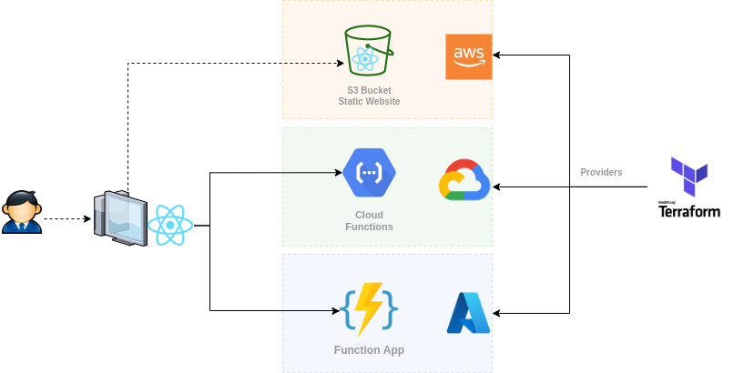

# Hands On Terraform 


- [Hands On Terraform](#hands-on-terraform)
  - [Architecture Context](#architecture-context)
  - [Create Your Infraestructure](#create-your-infraestructure)
  - [Deploy React App](#deploy-react-app)
    - [Update package.json](#update-packagejson)
    - [Compile and Deploy](#compile-and-deploy)


## Architecture Context




## Create Your Infraestructure


## Deploy React App

### Update package.json

Update in your package.json the value of your bucket. 

Example: 

```json
{
    ... other code
    "deploy": "aws s3 sync build/ s3://sandbox-hands-on-terraform-web-s3 --acl public-read"

    ...
}
```
if your bucket id is **laboratory-bucket**, then your deploy script will be:

```json
{
    ... other code
    "deploy": "aws s3 sync build/ s3://laboratory-bucket --acl public-read"

    ...
}
```

### Compile and Deploy

In the root folder of your react application execute the following command: 

`npm run-script build && npm run-script deploy`

## Deploy Azure Function App

Using the Azure project inside the repository you can Deploy all the infrastructure required for deploy a simple serverless function in Azure.

Project structure:

```bash
└───azure
    │   .gitignore
    │   .terraform.lock.hcl
    │   .terraform.tfstate.lock.info
    │   main.tf
    │   outputs.tf
    │   privider.tf
    │   README.md
    │   terraform.tfstate
    │   terraform.tfstate.backup
    │   variables.tf
    │   version.tf
    └───app
        │   .funcignore
        │   .gitignore
        │   host.json
        │   local.settings.json
        │   package-lock.json
        │   package.json
        │   proxies.json
        │
        └───hello-world
                function.json
                index.js
                sample.dat
```
the app folder contains all the Javascript code for Serverless function
### Requirements
- npm
- terraform
- Azure Account (Validate Student license)
- Visual Studio Code (recommended) and plugins:
    - Hashiscorp Terraform
    - Azure Account
    - Azure function
    - Azure Resources
### Dependences:
- Using npm package manager install Azure core tools :

```bash
    npm install -g azure-functions-core-tools@3 --unsafe-perm true

```
- For deploying the module:
Inside Azure folder
```bash
    terraform init
    terraform plan
    terraform apply
```

Note: You must be logged in azure portal using azure cli or azure pluging and being selected the subscription before running the commands.
